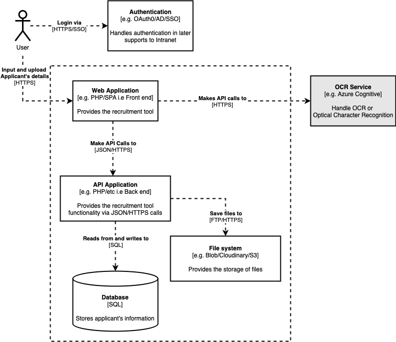
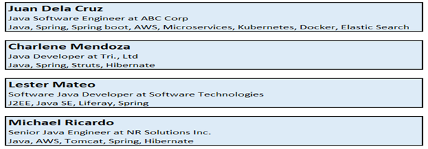

.. _DesignDocument:

Design Document
=================================================================================================================================

``DesignDocument``

Abstract:
~~~~~~~~~~~~~~~~~~~~~~~~~~~~~~~~~~~~~~~~~~~~~~~~~~~~~~~~~~~~~~~~~~~~~~~~~~~~~~~~~~~~~~~~~~~~~~~~~~~~~~~~~~~~~~~~~~~~~~~~~~~~~~~~~

    The Recruitment Tool will serve as a Database of the Recruitment Team for a long-term use.
    This is to manage the current and previous pool of candidates for different roles.
    The purposes of this tool are storing data/details of the :term:`applicants<Applicants>`, editing, and updating :term:`candidates<Candidates>`’ profile,
    retrieving of profiles, and  validating :term:`applicants<Applicants>`’ history.

Recruitment Interview:
~~~~~~~~~~~~~~~~~~~~~~~~~~~~~~~~~~~~~~~~~~~~~~~~~~~~~~~~~~~~~~~~~~~~~~~~~~~~~~~~~~~~~~~~~~~~~~~~~~~~~~~~~~~~~~~~~~~~~~~~~~~~~~~~~

    :term:`Applicants` will be interviewed by Recuiters, and in the future, by clients. Their interview statuses will be saved in
    the database associated with this tool.

Interview Sheet:
~~~~~~~~~~~~~~~~~~~~~~~~~~~~~~~~~~~~~~~~~~~~~~~~~~~~~~~~~~~~~~~~~~~~~~~~~~~~~~~~~~~~~~~~~~~~~~~~~~~~~~~~~~~~~~~~~~~~~~~~~~~~~~~~~

    This will contain notes which Recruiters have noted as the candidates' interviews are in progress.

Architecture Diagram:
~~~~~~~~~~~~~~~~~~~~~~~~~~~~~~~~~~~~~~~~~~~~~~~~~~~~~~~~~~~~~~~~~~~~~~~~~~~~~~~~~~~~~~~~~~~~~~~~~~~~~~~~~~~~~~~~~~~~~~~~~~~~~~~~~

Wireframes:
~~~~~~~~~~~~~~~~~~~~~~~~~~~~~~~~~~~~~~~~~~~~~~~~~~~~~~~~~~~~~~~~~~~~~~~~~~~~~~~~~~~~~~~~~~~~~~~~~~~~~~~~~~~~~~~~~~~~~~~~~~~~~~~~~

    Wireframe information will be determined soon

UI:
~~~~~~~~~~~~~~~~~~~~~~~~~~~~~~~~~~~~~~~~~~~~~~~~~~~~~~~~~~~~~~~~~~~~~~~~~~~~~~~~~~~~~~~~~~~~~~~~~~~~~~~~~~~~~~~~~~~~~~~~~~~~~~~~~

    - Users (Recruiters) must be able to manually input the details of the candidates or upload candidates’ profile to this tool
      once they have done the Initial Recruitment Interview.

    - Users (Recruiters) must be able to search candidates profile using any applicable keywords (Ex. Java, Spring, Manila, 3years).
      All candidates with the searched keywords must appear on the result list.

    - Users (Recruiters) must be able to edit candidates’ profile and to input status updates then history of changes or updates
      must be seen on the history with date.

    - Users (Recruiters) must be able to retrieve and download candidates’ profile with history of application and status.

    - There will be an Interview sheet for entering candidates’ details and there will be an upload button
      together with the Interview Sheet.

    - Any keywords and multiple keywords must be applicable to the Search Box, and it must show all the
      profiles containing the searched keywords.

    - The searched profiles must be presented in box with 3 lines (Name, Last position & Company, and Top skills).

